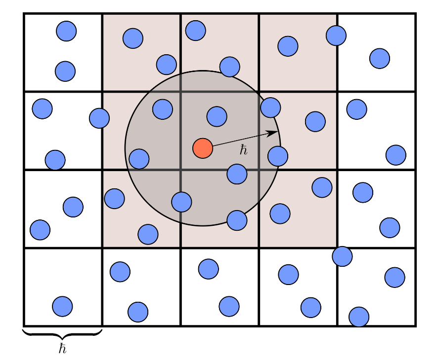

# Simulation: WaterBox
Pour la création du jeu WaterBox, nous avons dû trouver un algorithme de simulation de fluide réaliste, et dont l'implémentation en python ne poserait pas de soucis (des algorithmes trop complexes n'auraient pas trouvé une optimisation suffisante sans intégration de shaders GPU).

Notre choix s'est porté vers l'algorithme **SPH** (pour Smoothed Particle Hydrodynamics). Cet algorithme a été créé initialement pour aider à la résolution de problèmes en astrophysique, son implémentation peut se retrouver relativement optimisée si elle est bien faite, et son réalisme est plutôt correct.

# Les bases

## SPH: le kernel
La base de l'agorithme est relativement simple, les mathématiques réels se basent sur le principe de "discretization" de quantités spatiales, dans le cas de la simulation de fluide en fonction de la densité, mais il peut être compris comme tel:

Le but est de maintenir les particules à une densité prédéfinie (`self.rest_density` dans le code)

Une fonction appelée "fonction kernel" (notée $W()$ ) est utilisée pour cela, la densité de repo dépend même dans les faits de cette même fonction. Certains kernel sont disponibles sur internet dans des articles de recherches, et sont populaires pour certains de leurs aspects (notamment Poly6 ou Spiky), mais par simplicité un kernel plus simple trouvé dans une vidéo de démonstration à été repris:

$$ W(r) = \frac{{6(h-r)²}}{\pi h^4} $$

$r$: la distance entre deux particules\
$h$: le rayon de smoothing

Il est à noter que, la fonction de base n'est pas celle ci, elle ne dépend que de $r$ et de $h$ de manière assez simple, mais cette fonction est utilisée pour calculer une densité, il est alors important de la "normaliser", c'est à dire dans notre cas de la diviser par l'expression de son volume en fonction de h, c'est pour cela que le terme $\pi$ est présent.

On utilise cette fonction pour calculer la "densité" de chaque particules, qui est en fait la somme de toutes les valeurs de cette fonction par rapport à toutes les autres particules.

$$ \rho_i = \sum_j m_j W_{ij} $$

## Le gradient
Lorsque l'on obtient une densité pour chaque particule, nous pouvons alors procéder au calcul de la force à appliquer à chaque particule pour qu'elle se rapproche de la densité de repo, pour cela il nous faut utilisé la fonction appelée "kernel gradient", qui est en fait originalement la dérivée, et au moins dans l'utilisation correspondre à:

$$ \Delta W(r) = \frac{dW}{dr}\cdot\frac{\overrightarrow{r}}{r} $$

Pour cela notre intégration est la suivante;

$$ \Delta W(r) = \frac{(h-r)}{C}\\ $$

$$\text{avec}\ C= \frac{\frac{12}{h^4}}6$$

Et lors de l'application de la force, nous la calculons comme ceci:
```py
diff = particle.position - other.position

# Pressure force
r = diff.length()

if r > 0:
    direction = diff / r #Normalisation
else:
    direction = pygame.Vector2(0,0)

pressure_component = (
    -(other.mass * (particle.pressure + other.pressure) /
    (2.0 * other.density)) *
    self._kernel_gradient(r, h)
)

pressure_force += pressure_component * direction
```
Ceci constitue la base absolue de l'algorithme SPH.

# Notre implémentation
## La viscosité
Nous n'avons bien entendu pas inventé les formules qui nous ont permise de calculer la force de viscosité, même si cela se résume au final être relativement simple.

Il faut d'abord revenir rapidement sur le code qui implémente la force de pression, et voir qu'il est en réalité déduis d'une formule plus générale:

Pour calculer une propriété $A$ en un point $x$ nous avons;

$$ A(x) = \sum_i A_i \frac m{\rho_i} W(||x-x_i||) $$

Plus simplement, c'est la somme de la valeur de cette propriété (dans le cas de la viscosité la valeur est fixe `self.viscosity`) multiplié par un terme qui dépend de la densité et du kernel, et ce pour toutes les particules $i$ du système.

C'est alors ce que l'on fait dans notre implémentation:
```py
# Viscosity force
velocity_diff = other.velocity - particle.velocity
viscosity_component = (
    self.viscosity * other.mass / other.density *
    self._kernel(distance, h)
)
viscosity_force += velocity_diff * viscosity_component
```
## L'optimisation spatiale
Sans aucune optimisation l'algorithme est très fastidieux, et la plus grande perte de puissance se trouve dans la formule ci-dessus.

En effet, pour toute propriété $A$ nous devons parcourir toutes les particules, alors que si l'on regarde dans notre fonction kernel, toutes les particules qui ont une distance $\leq h$ sont ignorées.

Il devient alors utiles d'implémenter un "tri" spatial, qui consiste en fait à diviser l'espace en cases prédéfinie et stocker dans chaque cases les particules qui s'y trouves, lorsque l'on veut calculer une propriété il ne nous reste plus qu'à parcourir les cases adjacentes, de la manière suivante:



Note: dans le papier de recherche d'où cette image est tirée (voir Sources), $\hbar$ désigne le rayon d'influence $h$ dans notre code.

# Sources

## Utilisation de l'IA
Plusieurs modèles d'IA (dont Claude et GPT 5) ont été utilisés pour les recherches uniquement théoriques sur l'algorithme, ainsi que pour une fonction explicative de certains articles cités ci-dessous.

Le code en lui même n'a pas été généré par IA, il est néanmoins à noter pour la transparence que une implémentation de kernel avancés à été en partie générée par IA pour la compréhension du fonctionnement de cet algorithme, ce code a bien entendu été utilisé dans un but de test et n'a pas été transféré de quelconque manière dans le projet final.

## Sources externes
Veuillez trouver ci-dessous une liste des sources et médias consultés pour la réalisation de cette partie du projet.

- https://sph-tutorial.physics-simulation.org/pdf/SPH_Tutorial.pdf : Un article très avancé qui a été très bénéfique pour comprendre le fond de l'algorithme et ses enjeux.
- https://www.youtube.com/watch?v=rSKMYc1CQHE&t=486s : Une vidéo qui détail une implémentation de l'algorithme, c'est celle ci qui a initialement donnée l'idée d'utiliser cet algorithme, ainsi que les formules des kernel utilisés.
- https://deepwiki.com/yuki-koyama/position-based-fluids/1-position-based-fluids-overview : La documentation d'un algorithme alternatif qui a tout de même été bénéfique au projet.
- https://github.com/AyB2003/Pygame_Water_Simulator/tree/main : Un exemple d'implémentation de l'algorithme Open-source en python, qui a été utilisé pour mieux appréhender l'implémentation de l'agorithme avec Pygame.
- https://en.wikipedia.org/wiki/Smoothed-particle_hydrodynamics : Pour une explication plus vulgarisé de certaines equations.
